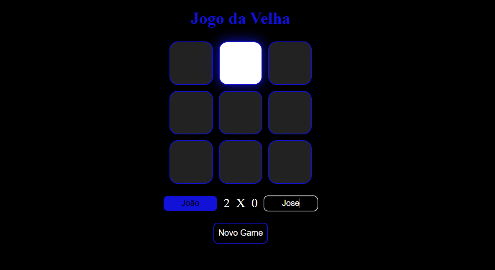

	
  

  

  

   Projeto desenvolvido no curso do ProgBR

   
 

  <a href="#clipboard-sobre-o-projeto">Sobre o Projeto</a>&nbsp;&nbsp;&nbsp;|&nbsp;&nbsp;&nbsp;
  <a href="#computer-tecnologias-utilizadas">Tecnologias</a>&nbsp;&nbsp;&nbsp;|&nbsp;&nbsp;&nbsp;
  <a href="#closed_book-licença">Licença</a>

## :clipboard: Sobre o Projeto

Projeto de construção de um jogo da velha que foi feito no curso programadorBR.  
Abaixo é possível ver uma captura do projeto original construído pelo professor. Algumas funcionalidades extras foram desenvolvidas por mim como atividade extra, tais como: 
- Estilização;
- Div que mostra o resultado após o termino da partida.
- Mecanismo para inserção dos nomes dos jogadores.
- Função que calcula o placar.
- Função para resetar o game.

  

## :computer: Tecnologias utilizadas

Skills:

- HTML
- CSS
- JavaScript

## :closed_book: Licença

Esse projeto está sob a licença MIT. Veja o arquivo [LICENSE](https://github.com/JeffersonSilemen/jogoDaVelha/blob/main/LICENSE) para mais detalhes.
